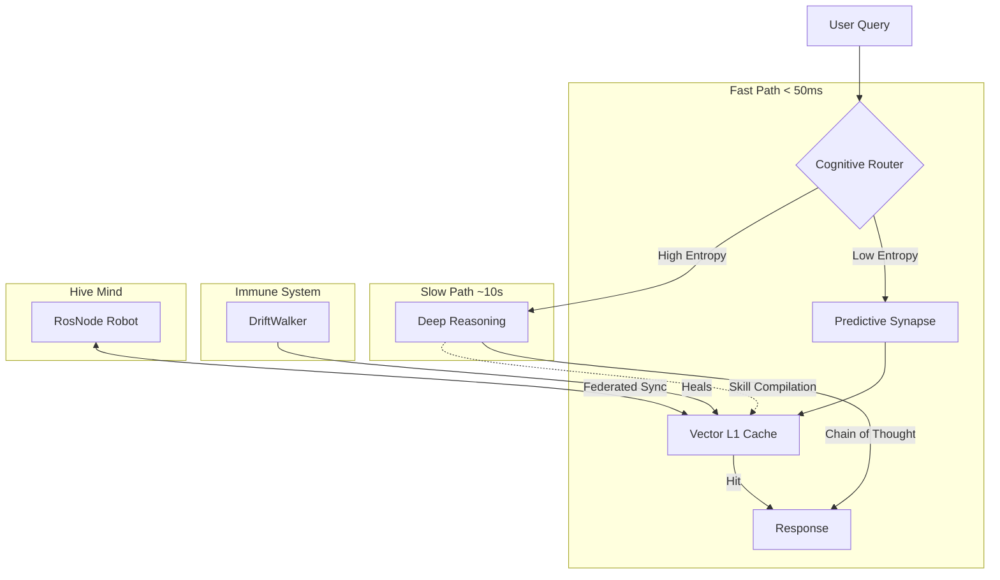

# AgentCache 2.0: Autonomous Cognitive Infrastructure

[](LICENSE)
[](https://agentcache.ai/trust)

**The Brain for your AI Agents.**
AgentCache is no longer just a semantic cache. It is a distributed, self-healing, evolutionary cognitive infrastructure designed to give your AI agents "Systems Thinking" capabilities.

---

## 🧠 Cognitive Architecture

AgentCache implements a **Dual-Process Theory** engine (System 1 vs System 2), giving your agents reflexes *and* reasoning.



## 🚀 Key Capabilities

### 1. Predictive Synapse (Pre-Cognition)
*   **What it does**: Predicts the user's *next* query before they type it.
*   **Math**: First-Order Markov Chain with Nucleus Sampling.
*   **Impact**: Enables **Negative Latency** by pre-fetching probable futures.

### 2. The Immune System (DriftWalker)
*   **What it does**: Detects "Semantic Rot" in your vector database caused by model updates capabilities drifting.
*   **Math**: Cosine Shift Detection ($1 - Similarity$).
*   **Impact**: Automatically re-embeds and heals decayed memories.

### 3. Neural Evolution
*   **What it does**: Optimizes your caching strategy (TTL, Eviction, Model routing) using Genetic Algorithms.
*   **Math**: Survival of the Fittest (Fitness = HitRate - Latency).
*   **Impact**: The system "evolves" to fit your specific traffic pattern over generations.

### 4. The Hive Mind (Federated Robotics)
*   **What it does**: Enables **Fleet Learning** for edge devices.
*   **Math**: Multi-Modal Vector Embeddings (CLIP/ViT).
*   **Impact**: If Robot A learns to avoid an obstacle, Robot B knows it instantly (Zero-Shot Transfer).

### 5. Universal Connector (MCP)
*   **What it does**: Exposes the "Brain" to external agents (Cursor, Claude, AutoGPT) via the Model Context Protocol.
*   **Tools**:
    *   `agentcache_predict_intent`: Foresee user intent.
    *   `agentcache_ask_system2`: Engage deep reasoning.
    *   `agentcache_hive_memory`: Access multi-modal memory.

---

## 🛠️ Usage

### Quick Start (MCP Server)
```bash
# Run the MCP Server to expose tools (Standard IO)
npm run mcp:start
```

### Edge Node (Robotics)
```typescript
import { RosNode } from 'agentcache-ai/edge';
const robot = new RosNode('worker-01');
// Sensation -> Perception -> Action
const action = await robot.process(sensorData);
```

### Cognitive Router
```typescript
import { CognitiveRouter } from 'agentcache-ai';
const route = await new CognitiveRouter().route("Design a nuclear reactor");
// Output: 'system_2'
```

---

## 📦 Installation

```bash
npm install agentcache-ai
```

## 🧪 Verification

Current System Status: **HEALTHY**
Run the full verification suite to confirm cognitive integrity:
```bash
npm run test:verify
```

---
*Built with ❤️ by the Neural Engineering Team at AgentCache.*
