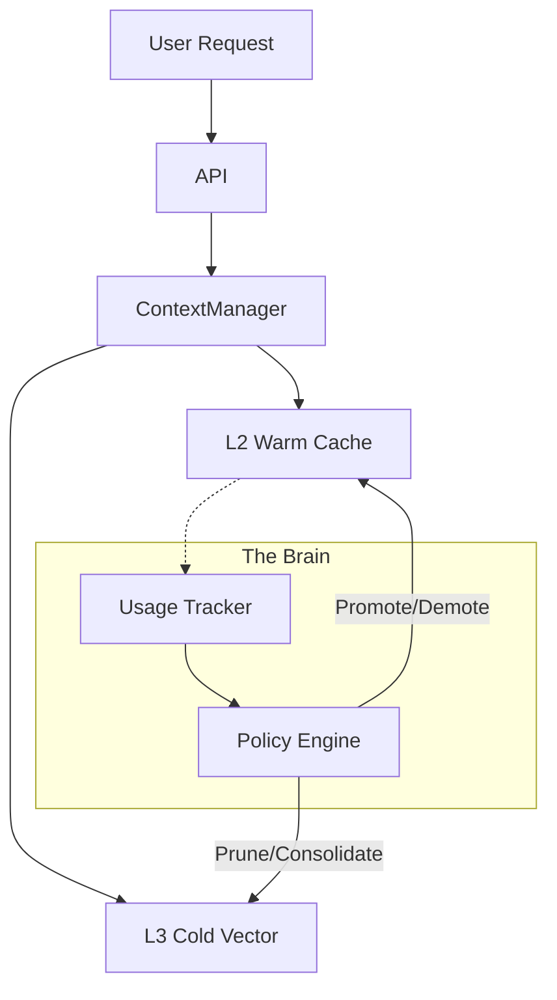

# DeepAgent: Autonomous Memory Optimization

## The Concept
**DeepAgent** is the "self-driving" component of AgentCache. Instead of relying on static TTLs (Time-To-Live) and manual eviction rules, DeepAgent uses a feedback loop to autonomously optimize the memory hierarchy.

It treats memory management as a **Reinforcement Learning (RL)** problem:
- **Agent:** The Cache Optimizer.
- **Environment:** The 3-Tier Memory System (L1/L2/L3).
- **Goal:** Maximize "Context Utility" (Hit Rate) while minimizing "Context Cost" (Storage/Latency).

## Core Mechanics

### 1. The "Utility Score"
Every memory item gets a dynamic `utility_score` (0.0 - 1.0) based on:
- **Recency:** How recently was it accessed? (Decay over time)
- **Frequency:** How often is it accessed? (Boost on hit)
- **Relevance:** Semantic distance to current active contexts. (Vector similarity)
- **Cost:** How expensive was it to generate? (Reasoning tokens = higher value)

### 2. Autonomous Actions
DeepAgent runs in the background (or piggybacks on requests) to perform:
- **Auto-Promotion:** Move high-utility items from L3 (Cold) -> L2 (Warm).
- **Auto-Demotion:** Move low-utility items from L2 -> L3 to save Redis costs.
- **Dreaming (Consolidation):** Periodically wake up to summarize fragmented memories in L3 into a single "Core Memory" (reducing vector search noise).
- **Forgetting:** Aggressively delete items with `utility_score < threshold`.

## Implementation Strategy (MVP)

### Phase 1: The "Observer"
- Track `access_count` and `last_accessed_at` for every item in Redis (L2).
- Calculate a simple `utility_score` on every read.

### Phase 2: The "Optimizer"
- Implement a `optimize()` method in `CognitiveEngine`.
- Triggered periodically (e.g., every 100 requests or via cron).
- **Logic:**
    - Scan L2 keys.
    - If `utility_score < 0.3` -> Move to L3 (or delete if already in L3).
    - If `utility_score > 0.8` -> Extend TTL.

### Phase 3: The "Dreamer" (Future)
- Use an LLM to summarize old L3 entries into compact "Episodic Memories".

## Architecture

