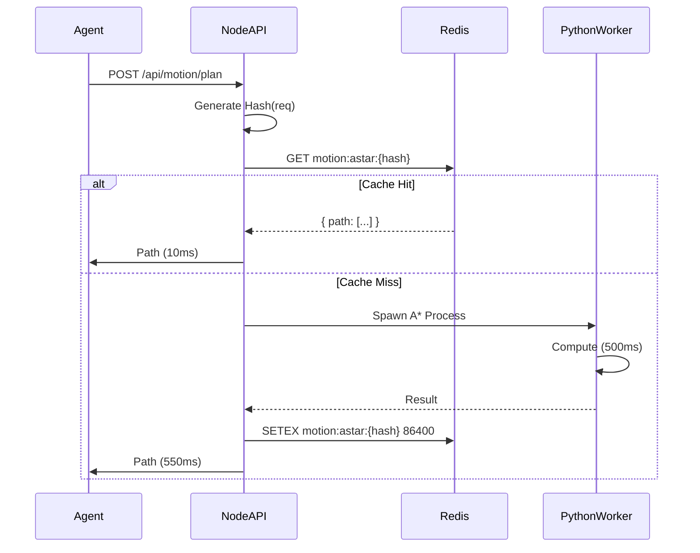

# AgentCache Sector Architecture (BluePrint V1)

## 1. Core Philosophy: "The Mechanics of Intelligence"
The platform acts as a hybrid bridge between **High-Latency Compute** (Python/Robotics/Bio) and **Low-Latency Agents** (Node/Redis).
The core mechanic is the **Flywheel**:
1.  **Request**: Agent asks for a complex calculation (Path, Protein Fold).
2.  **Hash**: Request is hashed (stable-json).
3.  **Check**: Redis Cache lookup.
    *   **Hit**: Return instantly (Value: Time/Energy Saved).
    *   **Miss**: Spawn Worker (Python/C++), Compute, Result -> Cache.

## 2. Standardized Interfaces
To ensure modularity as we expand to BioTech and Finance, all Sector Services must implement:

```typescript
// The Generic Contract
interface ISectorService<TReq, TRes> {
    // The main public method
    execute(request: TReq): Promise<TRes & { from_cache: boolean; latency: number }>;
    
    // Telemetry for the Dashboard
    getStats(): Promise<SectorStats>;
}

interface SectorStats {
    total_requests: number;
    cache_hits: number;
    saved_time_ms: number;
    // Optional sector-specific viz data
    latest_viz?: any; 
}
```

## 3. Directory Structure
```
src/services/sectors/
    ├── robotics/           # Sector: Logistics
    │   ├── MotionService.ts # Implements ISectorService
    │   └── algo/           # Python A* Scripts
    ├── biotech/            # Sector: Pharma
    │   ├── FoldingService.ts
    │   └── algo/           # AlphaFold Bridge
    └── finance/            # Sector: DeFi
        └── RiskService.ts
```

## 4. The "Flywheel" Data Flow


## 5. Deployment Strategy
*   **Probes**: Use `ProbeAgent` to autonomously market these capabilities.
*   **Telemetry**: Use Mission Control to visualization the "Saved Time" as the primary KPI.
