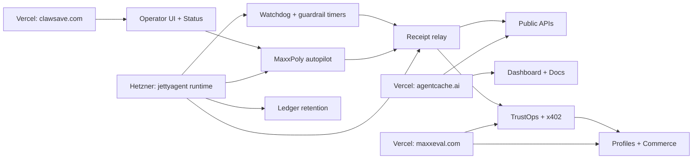

# Hetzner + Vercel Operating Model

Status: Draft v1  
Owner: Ontology Conglomerate Platform  
Date: 2026-03-14

## 1. Decision

Use `Vercel` for public product surfaces and lightweight APIs.

Use `Hetzner` for:

- long-running agent runtimes
- MaxxPoly bot execution
- watchdogs and schedulers
- receipt relay and normalization workers
- queue consumers
- archival and replay jobs
- control-plane services that should not depend on serverless runtime limits

This is the better operational design because it separates:

- `public delivery`
from
- `continuous autonomous operation`

## 2. Why This Is Better

### Vercel is best at

- fast iteration for product shells
- public dashboards
- public and paid API routes
- auth and lightweight control surfaces
- landing pages and operator consoles

### Hetzner is best at

- always-on workers
- long-lived bot processes
- timer and watchdog execution
- private network services
- stable file and ledger retention
- lower-cost background compute

### The key principle

`Do not run your sovereign bot runtime as if it were only a web route.`

MaxxPoly is already closer to an operating system workload than a page-rendering workload.

## 3. Platform Split

## 4. Recommended Deployment Roles

### AgentCache.ai on Vercel

Keep on Vercel:

- ontology APIs
- memory fabric APIs
- browser proof routes
- docs and dashboard
- lightweight provider entry points

Move or mirror to Hetzner later if needed:

- batch provenance reconciliation
- heavy indexing
- large export jobs

### MaxxEval.com on Vercel

Keep on Vercel:

- trust/profile APIs
- x402 gateway
- dashboards
- store/listing pages
- receipt export routes

Move or mirror to Hetzner later if needed:

- trust recomputation jobs
- large receipt bundle generation
- dispute/audit backfills

### ClawSave.com on Vercel

Keep on Vercel:

- control/status UI
- readonly performance views
- operator console
- safe command and control surface

Do not rely on Vercel for:

- primary bot loop
- watchdog enforcement
- guardrail timers
- durable execution ledgers

### JettyAgent / MaxxPoly on Hetzner

Run on Hetzner:

- `maxxpoly-autopilot.service`
- stale-state watchdog
- performance guardrail timer
- receipt relay daemon
- log and ledger archival

This aligns with the existing host bundle in [README.md](/Users/letstaco/Documents/jettyagent/ops/hetzner/README.md).

## 5. MaxxPoly Safety Rule

Do not modify:

- trading loop logic
- venue credentials
- order placement behavior
- risk gate thresholds
- live-engine state transitions

Only add:

- readonly export routes
- passive receipt building
- passive relay processes
- mirrored status/performance views

That keeps the Kalshi bot safe while still making the conglomerate observable and monetizable.

## 6. Shared Receipt Relay Design

### Goal

Turn MaxxPoly into a first-class producer of normalized receipts without changing execution logic.

### Safe source surfaces in JettyAgent

- `/api/maxxpoly/status`
- `/api/maxxpoly/performance`
- existing control cache and JSONL ledgers

### Relay responsibilities

The Hetzner relay should:

1. read status and performance snapshots locally
2. normalize them into `agentic.shared-receipt.v1`
3. sign them with a dedicated receipt secret
4. push them upstream to:
   - AgentCache evidence endpoint
   - MaxxEval ingestion endpoint
5. write a local dedup cache to avoid double emission

### First receipt types

- `STATUS_SNAPSHOT`
- `PERFORMANCE_SNAPSHOT`
- `BOT_CYCLE`

Later:

- `TRADE_INTENT`
- `TRADE_EXECUTION`

## 7. Network Design

### Public internet

- Vercel apps are public
- Hetzner relay may call public ingestion routes

### Auth

Use dedicated secrets for:

- MaxxPoly control access
- receipt relay signing
- upstream ingestion authorization

Do not reuse trading or venue secrets for receipt transport.

### Recommended env groups

- `TRADER_CONTROL_BOT_SECRET`
- `MAXXPOLY_TICK_SECRET`
- `SHARED_RECEIPT_SIGNING_SECRET`
- `MAXXEVAL_RECEIPT_INGEST_URL`
- `MAXXEVAL_RECEIPT_INGEST_SECRET`
- `AGENTCACHE_RECEIPT_INGEST_URL`
- `AGENTCACHE_RECEIPT_INGEST_SECRET`

## 8. Data Flow

### Status and performance

1. MaxxPoly writes local status/cache/ledger outputs
2. Hetzner relay reads those artifacts
3. Relay emits normalized receipts
4. MaxxEval persists them into `ExecutionReceipt`
5. AgentCache consumes them as evidence/provenance
6. ClawSave and MaxxEval dashboards display the summarized outputs

### Why relay instead of direct bot emission

Because relay mode is safer:

- no changes to core bot execution
- easier rollback
- easier auditing
- easier retries and backfills

## 9. Immediate Build Order

### Phase A

- finalize shared receipt schema
- build readonly MaxxPoly receipt export route
- build Hetzner receipt relay worker

### Phase B

- add MaxxEval receipt ingest route for ClawSave/JettyAgent
- persist shared receipt envelope inside `ExecutionReceipt.metadataJson`
- expose MaxxPoly receipts in trust/profile surfaces

### Phase C

- add AgentCache evidence ingestion for shared receipts
- correlate MaxxPoly runtime metrics with ontology/trust signals
- publish ROI and trust views across products

## 10. Ops Topology

### Vercel

- `agentcache.ai`
- `maxxeval.com`
- `clawsave.com`
- `symbiont.legal`

### Hetzner

- `jettyagent` runtime host
- receipt relay service
- scheduled trust/ROI batch jobs
- durable archived ledgers

## 11. Monitoring

Track separately:

### Runtime health

- MaxxPoly process health
- watchdog restarts
- guardrail enforcement events
- ledger freshness

### Receipt health

- receipts emitted per hour
- relay failures
- duplicate suppression count
- upstream ingest failures

### Business health

- bot uptime
- trade discipline
- evidence coverage
- trust freshness

## 12. Production Constraints

This model is stronger than all-Vercel because:

- serverless functions are not your runtime truth
- autonomous systems need stable background execution
- receipt pipelines benefit from durable local storage and retries

This model is stronger than all-Hetzner because:

- Vercel still gives faster product iteration and cleaner public API delivery
- public apps do not need to inherit your worker topology

## 13. Bottom Line

The right production shape is:

`Vercel for product surfaces, Hetzner for autonomous runtime and receipt infrastructure.`

For MaxxPoly specifically:

`keep the trading engine stable, add a passive receipt relay on Hetzner, and let MaxxEval and AgentCache consume the evidence.`
