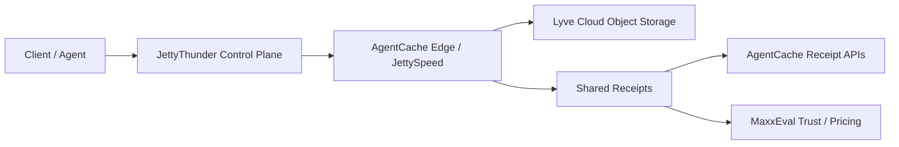

# Lyve Storage Mesh Strategy

Status: Active  
Date: 2026-03-14

## Purpose

This document defines how we should leverage Seagate Lyve Cloud as part of the AgentCache storage stack
without blurring ownership between repos or introducing silent transfer drift.

## Core Position

Lyve Cloud is valuable to us, but not as the whole product. In our stack it should play one role:

- `Lyve Cloud` = durable object substrate

Then we layer our own systems on top:

- `JettyThunder` = storage control plane and direct transfer runtime
- `AgentCache` = edge cache, chunk handoff, evidence layer, and ontology-aware memory fabric
- `MaxxEval` = trust, pricing, and receipt-based evaluation

That gives us a mesh, not just a bucket.

## Why This Makes Sense

Lyve gives us:

- durable S3-compatible storage
- multipart upload support
- object lifecycle and tiering primitives
- a storage substrate that can sit behind transfer acceleration

Our value comes from everything Lyve does not do natively:

- edge-aware chunk routing
- semantic reuse and memory classification
- transfer receipts and proof
- trust scoring and billing visibility
- sector-aware retention and evidence policy

## Ownership Boundaries

### JettyThunder Owns

- direct Lyve object operations
- multipart upload orchestration
- presigned URL issuance
- storage tenant and bucket policy execution
- any future network mesh worker that is physically moving bytes

### AgentCache Owns

- `POST /api/edges/optimal`
- `POST /api/jetty-speed/chunk`
- `GET /api/jetty-speed/chunk/:fileId/:chunkIndex`
- chunk cache hit/miss behavior
- transfer receipt creation and ingestion
- ontology-aware memory placement and retrieval policy

### MaxxEval Owns

- monetizing transfer evidence
- provider trust/export surfaces
- pricing and reporting based on receipt history

## Mesh Model

The point of the mesh is not to replace Lyve. It is to add:

- edge locality
- transfer evidence
- policy-aware routing
- ROI measurement

## Receipt Model

Storage operations should emit `STORAGE_TRANSFER` receipts.

Required fields:

- `producer.system`
- `producer.id`
- `subject.kind = STORAGE_TRANSFER`
- `subject.id = stable transfer id`
- `operation.provider = lyve`
- `operation.route`
- `trust.verdict`

Recommended refs:

- `bucket`
- `objectKey`
- `fileId`
- `edgeId`
- `etag`
- `multipartUploadId`

Recommended telemetry:

- `bytesTransferred`
- `chunkIndex`
- `chunkCount`
- `cacheHit`
- `cacheWarm`
- `latencyMs`
- `retryCount`

## Configuration Guardrails

We already have a real misconfiguration risk in the local ecosystem: at least one JettyThunder env file mixes
an endpoint that implies `us-east-1` with a configured region of `us-west-1`.

That kind of mismatch is exactly the sort of issue that creates plausibility without correctness:

- presigned URLs can fail
- STS/session flows can fail
- multipart operations can behave inconsistently
- debugging becomes expensive because credentials still "look valid"

So our rule should be:

1. endpoint and region must agree
2. receipt metadata should include the effective region
3. environment checks should warn loudly before runtime transfer starts

The operator entrypoint for this is:

- [verify_lyve_storage.ts](/Users/letstaco/Documents/agentcache-ai/scripts/verify_lyve_storage.ts)

## Security Posture

Our storage clients should assume object-scoped access, not bucket-admin access.

That means:

- successful upload, head, get, delete, and multipart flows matter more than `ListBucket`
- access-denied bucket listing is not automatically a bug
- presigned URLs and object-key-scoped credentials are preferable to broad bucket enumeration

Operationally, this is a better default for production than handing every runtime unrestricted list access.

## Near-Term Build Order

1. Keep Lyve as the durable production backend in the blob layer.
2. Emit `STORAGE_TRANSFER` receipts from JettyThunder-owned transfer flows.
3. Ingest those receipts into AgentCache.
4. Expose storage transfer summaries through trust and ROI surfaces.
5. Only then add more ambitious mesh behavior such as cross-edge warming or replay workers.

## What We Should Not Do Yet

- do not move core transfer authority away from JettyThunder
- do not couple live Lyve success to AgentCache being available
- do not embed raw object bodies into receipts
- do not introduce mesh replication before transfer evidence is stable

## Strategic Outcome

If we do this correctly, Lyve becomes part of a larger operating advantage:

- durable storage from Lyve
- acceleration and evidence from AgentCache
- monetization and trust from MaxxEval

That is a much stronger position than "we use an S3-compatible backend."
