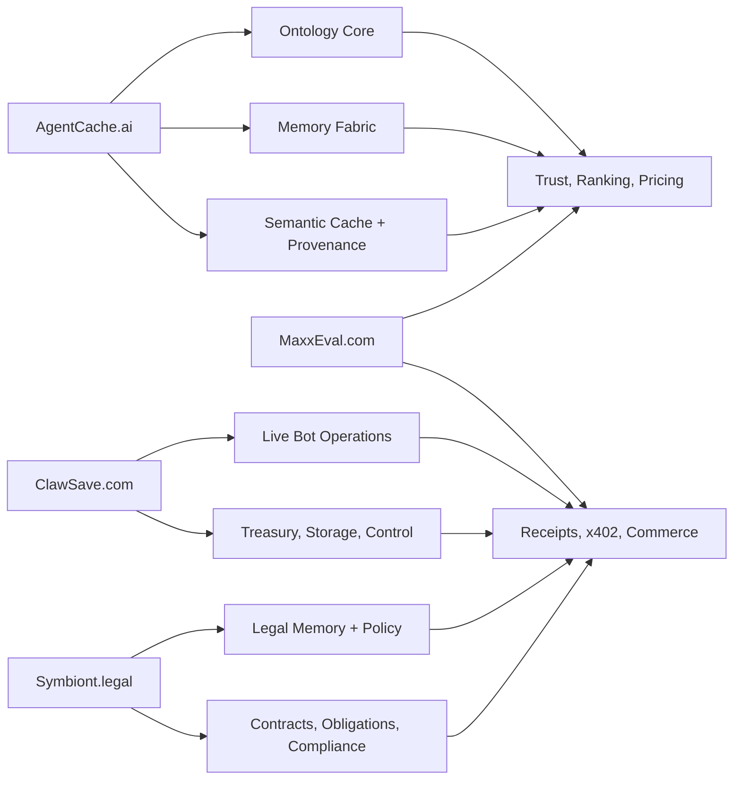

# Ontology Conglomerate Ground Plan

Superseded for active operating use by [ONTOLOGY_CONGLOMERATE_GROUND_PLAN_V2.md](/Users/letstaco/Documents/agentcache-ai/docs/specs/ONTOLOGY_CONGLOMERATE_GROUND_PLAN_V2.md).

Status: Draft v1  
Owner: AgentCache.ai / MaxxEval / ClawSave / Symbiont  
Date: 2026-03-14

## 1. Position

We are not building a generic AI app portfolio.

We are building a profitable ontology conglomerate whose core asset is:

- semantic namespace ownership
- ontology-backed memory and caching
- persistent agent identity and continuity
- signed trust and execution receipts
- autonomous economic operation through deployed agents

This is the ground we should claim:

`The ontology, memory, trust, and operating stack for production agents.`

Externally, we should talk about:

- memory fabric
- trust and evidence
- deployed agent operations
- vertical agent systems

Internally, the unifying theory can remain:

- semiotics
- agentic consciology
- ontology-driven sentience
- adaptive semantic continuity

## 2. Market Reality

The addressable market is real, but it is not best described as a social market for bots.

The real market is:

- enterprise teams deploying production agents
- operators running autonomous bots
- companies needing trust, observability, memory, and governance for agents
- high-value verticals where memory freshness, compliance, and cost matter

The current category is strongest in:

- agent infrastructure
- memory and cache optimization
- evaluation, trust, and governance
- verticalized agent operations

The category is weakest in:

- broad social/discovery products for agents
- generalized “AI community” products without direct economic value

Conclusion:

`The market exists, but we win by selling operating leverage, trust, and economics, not by selling abstraction alone.`

## 3. Conglomerate Architecture

## 4. Domain Roles

### AgentCache.ai

Canonical role:

- ontology and semantic backbone
- memory fabric and caching substrate
- provenance, browser proof, and evidence generation
- provider APIs for production agents

Primary buyers:

- AI platform teams
- agent operators
- enterprise engineering
- vertical application builders

Primary monetization:

- usage-priced APIs
- memory fabric subscriptions
- premium sector packages
- ontology mapping and bridge services

### MaxxEval.com

Canonical role:

- trust and evaluation layer
- commercial control plane
- receipt ledger, pricing, ranking, escrow, and x402 monetization

Primary buyers:

- agent buyers
- operators needing trust display
- teams buying evaluation and governance

Primary monetization:

- TrustOps subscriptions
- paid trust exports and evaluation APIs
- marketplace fees
- escrow and premium ranking

### ClawSave.com

Canonical role:

- deployed operational shell for autonomous bots
- live bot control, storage, durability, treasury, and telemetry
- proof that the conglomerate runs real revenue-seeking agents

Current anchor:

- `clawsave.com/maxxpoly`
- Kalshi automated trading via `/Users/letstaco/Documents/jettyagent`

Primary monetization:

- direct bot profit
- operator subscriptions
- premium control, storage, and risk tooling

### Symbiont.legal

Canonical role:

- legal-semantic vertical
- contract workflows
- policy memory
- obligation receipts
- compliance intelligence

Primary monetization:

- vertical subscriptions
- contract/evidence automation
- compliance-grade exports

## 5. What We Actually Sell

We should define four product classes.

### A. Semantic Infrastructure

- cache/get
- cache/set
- browser proof
- ontology map
- ontology bridge
- ontology excavation

### B. Trust Infrastructure

- execution receipts
- trust receipts
- ranking signals
- provider scorecards
- buyer trust filters

### C. Operating Systems For Agents

- bot runtime control
- treasury and storage operations
- telemetry and live-state surfaces
- risk guardrails

### D. Vertical Agent Systems

- finance memory fabric
- legal memory fabric
- enterprise copilot fabric
- later: healthcare and regulated operations

## 6. First Profitable Wedges

We should not launch all fronts equally.

### Wedge 1: Agentic Caching and Memory Fabric

Surface:

- AgentCache.ai

Buyers:

- teams already spending on LLMs and retrieval

Painkiller:

- lower cost
- lower latency
- higher reuse
- better freshness control

Proof metric:

- hit rate
- p95 latency reduction
- estimated cost saved per 1k tasks

### Wedge 2: TrustOps and Paid Evidence

Surface:

- MaxxEval.com

Buyers:

- teams needing proof, evaluation, and governance

Painkiller:

- trust and compliance visibility
- vendor and agent evaluation
- buyer confidence

Proof metric:

- receipts generated
- evaluation jobs completed
- conversion from free to paid trust surfaces

### Wedge 3: ClawSave as Live Proof of Autonomous Operation

Surface:

- ClawSave.com / MaxxPoly

Purpose:

- demonstrate that our stack operates a real agent business
- generate execution, risk, and treasury receipts
- create a showcase for agent profitability tooling

Proof metric:

- bot uptime
- trade discipline
- realized performance
- guardrail compliance

### Wedge 4: Symbiont Legal Vertical

Surface:

- Symbiont.legal

Purpose:

- turn ontology and memory into a defensible vertical with higher willingness to pay

Proof metric:

- contracts processed
- obligations extracted
- evidence bundles exported

## 7. Category Claim

This is the category we should claim:

`Ontology-native operating infrastructure for production agents.`

Secondary claims:

- semantic memory fabric
- trust and evidence fabric
- deployed bot operations
- vertical agent systems

Claims to avoid as primary:

- “social network for bots”
- “general AI community”
- “conscious AI platform”
- “HPC company”

Those either undersell the system or make buyer messaging too vague.

## 8. Competition Map

### We are not directly competing on:

- frontier model training
- generalized workflow automation alone
- raw vector databases
- generic observability only

### We are competing on:

- who owns agent memory and semantic reuse
- who owns trust receipts and evaluation
- who can make agents more profitable and governable
- who can verticalize ontologies into paid systems

### Why we can win

Because our stack combines:

- ontology registry
- cross-sector bridge logic
- memory fabric policy
- signed provenance
- trust scoring
- x402 monetization
- live operating agents

Most competitors only own one or two of those layers.

## 9. Repository Responsibilities

### `/Users/letstaco/Documents/agentcache-ai`

Owns:

- ontology registry and bridge
- semantic cache and memory fabric
- provenance services
- browser proof and evidence generation
- provider APIs
- ROI accounting for memory fabric

### `/Users/letstaco/Documents/maxxeval`

Owns:

- trust scoring
- execution receipt persistence
- x402 gateway
- paid trust/profile/receipt APIs
- job orders, escrow, and commerce

### `/Users/letstaco/Documents/jettyagent`

Owns:

- ClawSave runtime shell
- MaxxPoly bot operations
- operator control surfaces
- trading telemetry and risk controls

### `/Users/letstaco/Documents/symbiont-contracts`

Owns:

- legal vertical UI and workflows
- contract output surfaces
- legal evidence and obligation products

## 10. Shared Substrate Requirements

Across all fronts, we need common primitives.

### Identity

- stable principal identity
- agent identity continuity
- provider endpoint identity

### Receipts

- every important action produces a signed record
- receipts capture sign, interpretation, action, cost, and consequence

### Ontology Reference

- use `sectorId@version`
- include bridge trace when crossing sectors
- include sign class and confidence where available

### Economics

- every action has cost semantics
- usage must map to SKU, vertical, and evidence burden

### Trust

- trust is sector-relative
- trust decays without fresh evidence
- trust influences pricing and rank

## 11. 4-Phase Ground Plan

### Phase 1: Establish The Infrastructure Claim

Goal:

- make AgentCache.ai the clear ontology and memory backbone

Deliverables:

- ontology-backed SKUs
- browser-proof bundles
- ROI dashboards
- signed provenance on provider flows

Success signals:

- 3 design partners
- paid usage on memory APIs
- measurable cost savings in production

### Phase 2: Establish The Trust Claim

Goal:

- make MaxxEval the control plane for trust, evaluation, and paid receipts

Deliverables:

- receipt-backed agent profiles
- trust-ranked listings
- TrustOps subscriptions
- x402 catalog expansion

Success signals:

- repeat trust customers
- paid receipt exports
- provider-integrated trust scoring

### Phase 3: Establish The Operating Claim

Goal:

- prove we can run live, autonomous agent businesses

Deliverables:

- ClawSave runtime stability
- MaxxPoly evidence and ROI feeds
- control and telemetry surfaces tied into the receipt layer

Success signals:

- operator usage
- live bot uptime
- stable risk controls
- public proof of disciplined autonomous operation

### Phase 4: Establish The Vertical Claim

Goal:

- ship the first premium ontology vertical

Deliverables:

- Symbiont legal memory workflows
- obligation and policy receipts
- legal trust and evidence exports

Success signals:

- first vertical customers
- higher ACV than generic infrastructure SKUs

## 12. 90-Day Sequence

### Days 1-30

- finish AgentCache ontology-backed commercial APIs
- wire MaxxEval trust scoring to verified ontology receipts
- connect ClawSave telemetry into the shared receipt model
- define canonical receipt schema across repos

### Days 31-60

- launch ROI-backed memory fabric sales motion
- activate MaxxEval trust exports and provider ranking
- expose ClawSave as a live proof surface for bot operations
- define Symbiont legal ontology and first contract workflows

### Days 61-90

- ship first vertical legal/compliance SKU
- add trust-priced routing and marketplace visibility
- publish public case study using MaxxPoly and memory-fabric metrics
- package conglomerate-level narrative for partners and customers

## 13. KPIs

### Economic

- monthly recurring usage revenue
- TrustOps revenue
- x402 revenue
- direct bot operating profit

### Technical

- hit rate by SKU and sector
- receipt coverage rate
- browser-proof coverage rate
- trust-profile freshness
- bot uptime and guardrail adherence

### Commercial

- number of active providers
- paid agent accounts
- paid team accounts
- conversion from free profile to paid trust surface

## 14. Rules For What We Build Next

Build only if it improves at least one of:

- agent profitability
- trust and evidence
- ontology authority
- operating control
- vertical defensibility

Delay if it is mostly:

- cosmetic community functionality
- social/profile decoration without receipts
- unsupported vertical sprawl
- infrastructure work with no path to measured advantage

## 15. Immediate Next Moves

1. Treat this document as the canonical category and architecture statement.
2. Align AgentCache, MaxxEval, ClawSave, and Symbiont docs to this framing.
3. Wire `jettyagent` telemetry and MaxxPoly runtime outputs into the shared receipt model.
4. Expand MaxxEval paid ontology and trust surfaces.
5. Define the first Symbiont legal ontology package and obligation receipt schema.

## 16. Bottom Line

The correct ambition is not to become “another AI tool.”

The correct ambition is:

`to become the ontology conglomerate that production agents run through, prove themselves through, and make money through.`

That is broad enough to matter and concrete enough to execute.
